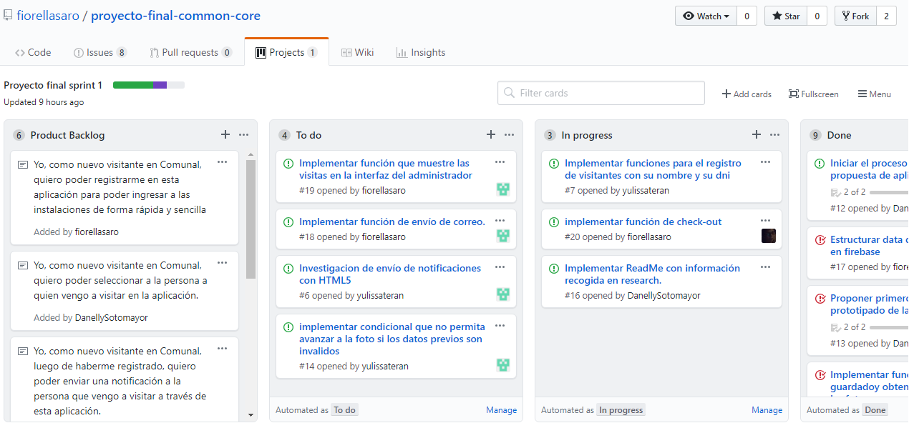

# Registro de visitantes para Comunal
## Introducción
La empresa de coworking donde opera Laboratoria nos solicitó reinventar su proceso de registro de visitantes actual con el objetivo de mejorar su servicio y mantenerse competitivos con respecto a otras empresas del mismo rubro. Para ello, aplicamos técnicas de research con el objetivo de recabar información y entregar una propuesta que coincida con sus objetivos de empresa y valores de marca.

## Proceso de planeamiento
Para iniciar el planeamiento nos organizamos como equipo utilizando el método Kanban.

Asimismo, como equipo nos organizamos en áreas de trabajo según lo siguiente:
* 01 Diseñadora UX, quien se encargó de diseñar la experiencia de la aplicación (flujo, interacción, etc.), así como identificar, documentar y priorizar las historias de usuario para plasmarlos en el  diseño visual de la interfaz.
* 02 Desarrolladoras Front-end, quienes debían implementar la interfaz de usuario diseñada (HTML/CSS/JS) y las pruebas unitarias.

### Historias de usuario
Se plantearon las siguientes historias de usuario de acuerdo a la investigación realizada (se especificará en el siguiente ítem):

1. Yo, como nuevo visitante en Comunal, quiero poder registrarme en esta aplicación para poder ingresar a las instalaciones de forma rápida y sencilla.
2. Yo, como nuevo visitante en Comunal, quiero poder seleccionar a la persona a quien vengo a visitar en la aplicación.
3. Yo, como nuevo visitante en Comunal, luego de haberme registrado, quiero poder enviar una notificación a la persona que vengo a visitar a través de esta aplicación.
4. Yo, como visitado, deseo poder recibir una notificación en mi correo cuando alguien viene a visitarme en mi oficina.
5. Yo, como administrador de Comunal, quiero poder visualizar los datos, foto, hora de ingreso y salida del nuevo visitante en mi interfaz.
6. Yo, como visitante, deseo poder registrar mi salida de las instalaciones de Comunal.

## Proceso de investigación
### Lineamientos del cliente
Comunal es una empresa de coworking que ofrece diferentes opciones de espacios para todo tipo de empresas. Desde oficinas privadas para 200 personas, espacios Flex para nuevos emprendimientos, hasta Escritorios Dedicados para pequeñas empresas o equipos pequeños de emprendedores. Tiene una cultura organizacional que lo distingue de otras empresas de coworking pues prima el trato familiar y amical, llamándose a cada miembro de las oficinas "comuneros".

### Benchmarking
Realizamos la investigación de 03 lugares en particular que cuentan con buenas prácticas en registro de visitantes y nos pueden dar un mayor acercamiento al objetivo y uso de herramientas digitales para el registro de visitantes.

### Análisis de competencia
Identificamos como competencia directa a la empresa WeWork, empresa de coworking internacional con varias sedes en el país, quien en la actualidad cuenta con un registro virtual de visitantes. En sus sedes en el extranjero, cuentan con un registro anticipado de visitantes a través de una aplicación. Este registro debe hacerlo previamente el anfitrión, ingresando los datos y fotografía del invitado y subiendola a la app.

En sus sedes en el país, sus sistemas de registro varían entre el sistema electrónico a través de tablets y el sistema tradicional, donde el recepcionista toma los datos del visitado en una tabla.

### Entrevistas
Se plantearon 03 tipos de entrevistas: 01 al cliente, en este caso, la empresa de coworking Comunal, 01 a un encargado de registro de un edificio, y 01 a usuarios que suelen visitar empresas y utilizar diferentes sistemas de registros. A continuación el listado de preguntas que se realizaron a cada tipo de usuarios:

**Guía de preguntas - Cliente**
1. ¿Cuántas empresas funcionan dentro de Comunal?
2. Durante el día, ¿cuántas visitas reciben aproximadamente?
3. ¿Qué datos les solicitan a las personas que vienen a visitar?
4. ¿Cuál es el sistema que usan para el registro de visitantes?
5. Si pudieran cambiar este sistema, ¿qué implementarían?
6. ¿Qué opinan sobre la implementación de un sistema tecnológico para el registro de visitantes?
7. ¿Qué opinan sobre darle la opción al visitante de elegir a quién viene a ver?
8. ¿Qué pasaría si las notificaciones de visita fueran por correo?
9. ¿En qué parte del edificio debería ubicarse esta aplicación?

**Guía de preguntas - Encargado de registro**
1. ¿Cuál es el proceso que siguen usualmente para el registro de visitantes?
2. ¿Se conoce previamente el nombre de visitantes que llegarán?
3. ¿Tienen algún formato o interfaz para el registro de visitas?
4. ¿Considera que les sería útil tener una interfaz donde el visitante se registre solo?

#### Entrevista a cliente:

 